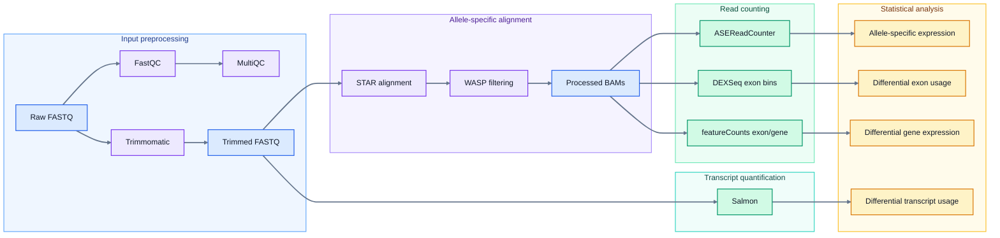

# Vj6SL

<!-- badges: start -->
[](https://www.gnu.org/licenses/gpl-3.0)
<!-- badges: end -->

## Overview

This repository contains an SLURM-based workflow for processing and analyzing paired-end bulk RNA-seq data with SNPs: 

- Input preprocessing: QC and adapter trimming
- Allele-specific alignment using STAR+WASP
- Allele-specific expression (ASE) analysis: ASEReadCounter + binomial test
- Differential exon usage (DEU) analysis: HTSeq + DEXSeq
- Differential gene expression (DGE) analysis: FeatureCounts + DESeq2/limma/edgeR
- Differential transcript usage (DTU) analysis: Salmon + DRIMSeq 

The repository is organized as a **workflow repository**, not as an installable software package.


## Diagram of processing and analysis pipeline



## Table of contents

- [Repository structure](#repository-structure)
- [Environment setup](#environment-setup)
- [Input files](#input-files)
- [Data processing and analysis workflow](#data-processing-and-analysis-workflow)
  - [Step 0: Prepare sample list and check input file validity](#step-0-prepare-sample-list-and-check-input-file-validity)
  - [Step 1: Run FastQC on raw FASTQ files](#step-1-run-fastqc-on-raw-fastq-files)
  - [Step 2: Trim adapters with Trimmomatic](#step-2-trim-adapters-with-trimmomatic)
  - [Step 3: Perform allele-specific alignment with STAR/WASP](#step-3-perform-allele-specific-alignment-with-starwasp)
  - [Step 4: Allele-specific expression (ASE) analysis](#step-4-allele-specific-expression-ase-analysis)
  - [Step 5. Differential exon usage (DEU) analysis using HTSeq and DEXSeq](#step-5-differential-exon-usage-deu-analysis-using-htseq-and-dexseq)
  - [Step 6. Differential gene expression (DGE) analysis with FeatureCounts](#step-6-differential-gene-expression-dge-analysis-with-featurecounts)
  - [Step 7. Differential transcript usage (DTU) analysis using Salmon and DRIMSeq](#step-7-differential-transcript-usage-dtu-analysis-using-salmon-and-drimseq)
- [Notes](#notes)
- [License](#license)

## Repository structure

```text
Vj6SL/
├── README.md
├── directory_structure.md
├── pipeline_diagram.md
├── data/
├── envs/
│   ├── install_r_packages.R
│   ├── README.md
│   └── rnaseq_python.yaml
├── logs/
├── modules/
├── ref_data/
├── scripts/
│   ├── bash/
│   ├── python/
│   └── R/
└── variant_files/
```

Main directories:

| Directory | Description |
|---|---|
| `data/` | Input and output data directories for each workflow step. Real data not tracked. |
| `envs/` | Conda/R environment files and dependency installation scripts. |
| `logs/` | SLURM log files. Logs are not tracked. |
| `modules/` | Scripts to install the required software and create modules on HPC. |
| `ref_data/` | Reference genome, annotation, and indexes. Not tracked. |
| `scripts/bash/` | SLURM/bash scripts for each workflow step. |
| `scripts/python/` | Python helper scripts for ASE and DEXSeq processing. |
| `scripts/R/` | R scripts for ASE, DEXSeq, and DTU analyses. |
| `variant_files/` | Mock/example VCF file location. Real variant files are not tracked. |

For a more detailed file structure, see [directory_structure.md](directory_structure.md)


## Environment setup

This workflow was designed for an HPC system using SLURM and Lmod modules. 

### Required software

The workflow uses the following tools:

| Tool | Version | Main use |
|---|---:|---|
| FastQC | 0.12.1 | Raw FASTQ quality control |
| Trimmomatic | 0.39 | Adapter and quality trimming |
| STAR | 2.7.8a | RNA-seq alignment |
| Samtools | 1.18 | BAM/SAM processing |
| HTSlib | 1.18 | `bgzip`, `tabix`, HTS utilities |
| BCFtools | 1.18 | VCF/BCF processing |
| GATK | 4.5.0.0 | ASEReadCounter and variant processing |
| gffread | 0.12.7 | GTF/GFF processing and transcript FASTA generation |
| Subread | 2.0.0 | `featureCounts` |
| Salmon | 1.10.1 | Transcript-level quantification |
| MultiQC | site/module-dependent | QC report aggregation |
| Python | >=3.9 recommended | Helper scripts |
| R | >=4.3 recommended | DEXSeq, DIRMSeq, and statistical analysis |

### 1. Install software modules

The `modules/` directory contains installation scripts and Lua modulefiles.

Each software has the form:

```text
modules/<tool>/
├── <version>.lua
└── install_<tool>_<version>.sh
```

Example:

```text
modules/samtools/
├── 1.18.lua
└── install_samtools_1.18.sh
```

Set a shared installation directory:

```bash
export SOFTWARE_ROOT=/path/to/shared/software
```

Then install tools as needed:

```bash
bash modules/fastqc/install_fastqc_0.12.1.sh
bash modules/trimmomatic/install_trimmomatic_0.39.sh
bash modules/star/install_star_2.7.8a.sh
bash modules/samtools/install_samtools_1.18.sh
bash modules/htslib/install_htslib_1.18.sh
bash modules/bcftools/install_bcftools_1.18.sh
bash modules/gatk/install_gatk_4.5.0.0.sh
bash modules/gffread/install_gffread_0.12.7.sh
bash modules/subread/install_subread_2.0.0.sh
bash modules/salmon/install_salmon_1.10.1.sh
```

After installation, place or symlink the Lua files into the system's Lmod modulefile directory.


### 2. Set up the Python environment

Python helper scripts are located in:

```text
scripts/python/
```

The Python environment file is:

```text
envs/rnaseq_python.yaml
```

To install, use the conda or mamba: 

```bash
module load conda/3-23.3.1

mamba env create -f envs/rnaseq_python.yaml
# or:
# conda env create -f envs/rnaseq_python.yaml

conda activate rnaseq
```

See the [Python environment setup](envs/README.md#python-environment) for details on Python dependencies.


### 3. Install R dependencies

R scripts are located in:

```text
scripts/R/
```

R dependencies are installed directly in R using:

```text
envs/install_r_packages.R
```

To install: 

```bash
Rscript envs/install_r_packages.R
```

See the [R package setup](envs/README.md#r-packages) for details on R dependencies.


## Input files

Before running the workflow, prepare the following input files.


### 1. Raw FASTQ files

Put paired-end FASTQ files in:

```text
data/0_RawData/
```

Expected naming convention: 

```text
sample01_1.fq.gz
sample01_2.fq.gz
sample02_1.fq.gz
sample02_2.fq.gz
```

### 2. Sample list

The workflow expects:

```text
data/sample_list.txt
```

Example:

```text
sample1
sample2
sample3
sample4
```

Each line should contain one sample ID. See [sample_list.txt](data/sample_list.txt) for an example.


### 3. Sample metadata

The workflow expects a sample sheet containing a grouping category (for example, genotype) in the "condition" column for each sample: 

```text
data/samplesheet.csv
```
See [samplesheet.csv](data/samplesheet.csv) for an example.


### 4. Reference files

Reference files should be placed under:

```text
ref_data/
```

Expected layout:

```text
ref_data/
├── GRCm39/
│   └── refFlat.txt
└── refdata-gex-GRCm39-2024-A/
    ├── fasta/
    │   ├── genome.fa
    │   ├── genome.fa.fai
    │   └── genome.dict
    ├── genes/
    │   └── genes.gtf
    └── star_2.7.8a/
        └── STAR genome index files
```

Reference genome files are not included in the repository.


### 5. Variant file

A VCF file compatible with the `STAR` and `gatk` tools is required. A small mock VCF is included at:

```text
variant_files/variant_list_mm39.vcf
```


## Data processing and analysis workflow

All main workflow scripts are in:

```text
scripts/bash/
```

The workflow is designed to run with SLURM using `sbatch`.

### Step 0: Prepare sample list and check input file validity

- create sample list files
- verify that each paired-end sample has both Read 1 and Read 2

```bash
sbatch scripts/bash/t0_prepare.sh 
```


### Step 1: Run FastQC on raw FASTQ files

- perform FastQC for each raw fastq file
- summarizes results with MultiQC

```bash
sbatch scripts/bash/t1_FastQC.sh
```

Input:
```text
data/0_RawData/
```

Output:
```text
data/1_FastQC/
```

### Step 2: Trim adapters with Trimmomatic

- trims adapters and removes low-quality bases

```bash
sbatch scripts/bash/t2_Trimmomatic.sh
```
Optionally specify number of samples per SLURM array task:
```bash
sbatch scripts/bash/t2_Trimmomatic.sh 2
```

Input:
```text
data/0_RawData/
```

Output:
```text
data/2_TrimmedData/
```

Expected outputs per sample:
```text
<sample>_1_paired.fq.gz
<sample>_1_unpaired.fq.gz
<sample>_2_paired.fq.gz
<sample>_2_unpaired.fq.gz
```

### Step 3: Perform allele-specific alignment with STAR/WASP 

#### Verify and prepare reference for alignment 

- verify genome fasta and GFT files
- generate STAR index for genes
- verify vcf files 
- verify trimmed fastq directory 

```bash
sbatch scripts/bash/t3-0_STAR_prepare.sh
```
Expected reference inputs:
```text
ref_data/refdata-gex-GRCm39-2024-A/fasta/genome.fa
ref_data/refdata-gex-GRCm39-2024-A/genes/genes.gtf
ref_data/refdata-gex-GRCm39-2024-A/star_2.7.8a/
```

#### Run STAR/WASP alignment

- aligned trimmed fastq to reference
- index output BAM files 

```bash
sbatch scripts/bash/t3-1_STAR_WASP_align.sh
```

Input:
```text
data/2_TrimmedData/
```

Output:
```text
data/3_STAR_Alignment/aligned_bams/
data/3_STAR_Alignment/reports/
data/3_STAR_Alignment/stats/
```

#### Run WASP filtering 
- filter alignments to retain alignments with WASP vW:i:1 or no vW tags
- index output BAM files 

```bash
sbatch scripts/bash/t3-2_WASP_filter.sh
```

Input:
```text
data/3_STAR_Alignment/aligned_bams/
variant_files/
```

Output:
```text
data/3_STAR_Alignment/filtered_bams/
```

#### Add read groups 

- Add read groups to meet `gatk` requirements. 

```bash
sbatch scripts/bash/t3-3_add_readGroups.sh
```
Input:
```text
data/3_STAR_Alignment/filtered_bams/
```

Output:
```text
data/3_STAR_Alignment/filtered_bams/
```

#### Run post-alignment QC

- Perform QC using gatk/Picard tools on the WASP-filtered BAM files. 

```bash
sbatch scripts/bash/t3-4_picard_qc.sh
```

Input:
```text
data/3_STAR_Alignment/filtered_bams/
```

Output:
```text
data/3_STAR_Alignment/multiqc_outputs/
data/3_STAR_Alignment/stats/
```

#### Summarize post-filter QC with MultiQC
 
- Summarize QC results for WASP-filtered BAMs using MultiQC, including `samtools flagstat` and `gatk` QC outputs

```bash
sbatch scripts/bash/t3-5_post_filter_multiqc.sh
```

Output:
```text
data/3_STAR_Alignment/multiqc_outputs/
```

### Step 4: Allele-specific expression (ASE) analysis

#### Prepare ASE inputs

- Compress VCF file and create index.
- Create reference dictionary for `ASEReadCounter`

```bash
sbatch scripts/bash/t4-0_ase_prepare.sh
```

Expected inputs:
```text
data/3_STAR_Alignment/filtered_bams/
variant_files/
```

#### Run GATK ASEReadCounter

- Count allele expression using ASEReadCounter.

```bash
sbatch scripts/bash/t4-1_ase_readcounter.sh
```

Input:
```text
data/3_STAR_Alignment/filtered_bams/
variant_files/
```

Output:
```text
data/4_ASE_Analysis/allele_counts_Q20/
```

#### Extract reads overlapping the variant positions. 
- Extract reads. 

```bash
sbatch scripts/bash/t4-2_ase_extract_variant_reads.sh
```

Output:
```text
data/4_ASE_Analysis/variant_read_sequences/
```

#### Normalize ASE counts to total library size for ASE analysis
 
- count mapped reads per sample. 
- compute normalized REF and ALT counts. 

```bash
sbatch scripts/bash/t4-3_ase_normalized_expr.sh
```
Output:
```text
data/4_ASE_Analysis/normalized_expression/
```

#### Run ASE statistical analysis in R

- prepares ASE count data and sample information. 
- tests allelic imbalance in heterozygous samples. 
- analyzes allele-specific expression for heterozygous and control samples. 

Run the R scripts in order:
```bash
Rscript scripts/R/t4-4-0_ASE_prepare.R
Rscript scripts/R/t4-4-1_ASE_het-allelic-imbalance.R
Rscript scripts/R/t4-4-2_ASE_allele-expr.R
```


### Step 5. Differential exon usage (DEU) analysis using HTSeq and DEXSeq

#### Prepare DEXSeq annotation

- Prepare gene annotations for DEXSeq exon read counts. 

```bash
sbatch scripts/bash/t5-0_dexseq_prepare.sh
```

Input:
```text
ref_data/refdata-gex-GRCm39-2024-A/genes/genes.gtf
```

Output:
```text
data/5_DEXSeq/annotation/
```

#### Count reads overlapping DEXSeq exon bins

- Count reads overlapping DEXSeq exon bins. 

```bash
sbatch scripts/bash/t5-1_dexseq_count.sh
```

Input:
```text
data/3_STAR_Alignment/filtered_bams/
data/5_DEXSeq/annotation/
```

Output:
```text
data/5_DEXSeq/counts/
```

#### Summarize DEXSeq counts
 
- Summarize DEXSeq count ouputs for QC purposes. 

```bash
sbatch scripts/bash/t5-2_dexseq_summary.sh
```

Output:
```text
data/5_DEXSeq/count_qc/
```

#### Run DEXSeq differential exon usage analysis in R

- prepares DEXSeq objects
- runs differential exon usage analysis by condition

Run these in order: 
```bash
Rscript scripts/R/t5-3-0_DEXSeq_prepare.R
Rscript scripts/R/t5-3-1_dexseq_DEU_by-genotype.R
```


### Step 6. Differential gene expression (DGE) analysis with FeatureCounts

#### Run featureCounts

- Run featureCounts to estimate gene-level counts.
- Run featureCounts to estimate exon-level counts. 

```bash
sbatch scripts/bash/t6-1_featurecounts.sh
```

Input:
```text
data/3_STAR_Alignment/filtered_bams/
ref_data/refdata-gex-GRCm39-2024-A/genes/genes.gtf
```

Output:
```text
data/6_featureCounts/gene_counts/
data/6_featureCounts/exon_counts/
```

#### Summarize featureCounts output with MultiQC

- Summarize featureCounts outputs using MultiQC

```bash
sbatch scripts/bash/t6-2_featurecounts_multiqc.sh
```

Output:
```text
data/6_featureCounts/multiqc/
```

The exon and gene counts can then be analyzed for differential expression using `DESeq2`, `limma` or other tools. 


### Step 7. Differential transcript usage (DTU) analysis using Salmon and DRIMSeq

#### Prepare Salmon transcriptome reference and index
 
- Check input files 
- Extract transcript sequences from GTF 
- Build Salmon index

```bash
sbatch scripts/bash/t7-0_salmon_prepare.sh
```

Input:
```text
ref_data/refdata-gex-GRCm39-2024-A/fasta/genome.fa
ref_data/refdata-gex-GRCm39-2024-A/genes/genes.gtf
```

Output:
```text
data/7_Salmon/reference/
data/7_Salmon/index/
```

#### Run Salmon quantification

- Quantify transcript abundance with Salmon. 

```bash
sbatch scripts/bash/t7-1_salmon_quant.sh
```

Input:
```text
data/2_TrimmedData/
data/7_Salmon/index/
```

Output:
```text
data/7_Salmon/quant/
```

#### Summarize Salmon outputs with MultiQC

- MultiQC summary for Salmon outputs

```bash
sbatch scripts/bash/t7-2_salmon_multiqc.sh
```

Output:
```text
data/7_Salmon/multiqc/
```

#### Prepare DTU analysis in R

- process Salmon outputs and sample information for statistical tests. 

```bash
Rscript scripts/R/t7-3-0_DTU_prepare.R
```

The final DTU statistical testing code is under development.


## Notes

- This workflow assumes paired-end, unstranded RNA-seq data.
- Scripts are designed for SLURM-based HPC systems.

## License

GPL (>= 3)

## Author

Anna Luo


