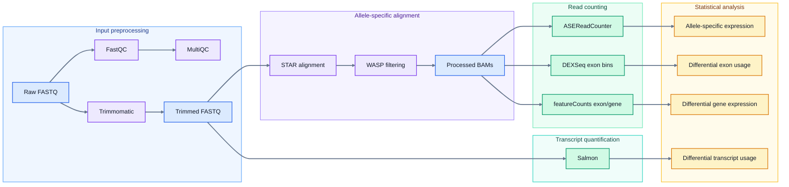

# Diagram of processing and analysis pipeline

```mermaid
flowchart LR

    subgraph S1[Input preprocessing]
        A["Raw FASTQ"] --> B["FastQC"]
        B --> C["MultiQC"]
        A --> D["Trimmomatic"]
        D --> E["Trimmed FASTQ"]
    end

    subgraph S2[Allele-specific alignment]
        E --> F["STAR alignment"]
        F --> G["WASP filtering"]
        G --> H["Processed BAMs"]
    end

    subgraph S3[Read counting]
        H --> I["ASEReadCounter"]
        H --> J["DEXSeq exon bins"]
        H --> K["featureCounts exon/gene"]
    end

    subgraph S4[Transcript quantification]
        E --> L["Salmon"]
    end

    subgraph S5[Statistical analysis]
        I --> M["Allele-specific expression"]
        J --> N["Differential exon usage"]
        K --> O["Differential gene expression"]
        L --> P["Differential transcript usage"]
    end

    %% Node colors
    classDef input fill:#DBEAFE,stroke:#2563EB,stroke-width:1.6px,color:#111827
    classDef process fill:#EDE9FE,stroke:#7C3AED,stroke-width:1.6px,color:#111827
    classDef counting fill:#D1FAE5,stroke:#059669,stroke-width:1.6px,color:#111827
    classDef output fill:#FEF3C7,stroke:#D97706,stroke-width:1.6px,color:#111827

    class A,E,H input
    class B,C,D,F,G process
    class I,J,K,L counting
    class M,N,O,P output

    %% Group box colors
    style S1 fill:#EFF6FF,stroke:#60A5FA,stroke-width:1.5px,color:#1E3A8A
    style S2 fill:#F5F3FF,stroke:#A78BFA,stroke-width:1.5px,color:#4C1D95
    style S3 fill:#ECFDF5,stroke:#6EE7B7,stroke-width:1.5px,color:#064E3B
    style S4 fill:#F0FDFA,stroke:#2DD4BF,stroke-width:1.5px,color:#134E4A
    style S5 fill:#FFFBEB,stroke:#FBBF24,stroke-width:1.5px,color:#78350F

    %% Arrow styling
    linkStyle default stroke:#64748B,stroke-width:2.3px
```
